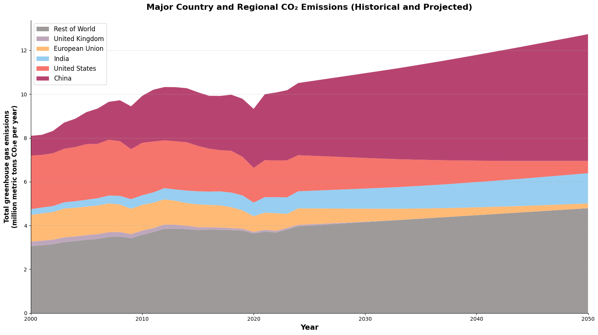

# CO₂ Emissions & Energy Sources Analysis (2000–2050)

**Course:** BUSINFO 701 — Business Analytics Tools (group of 5; my focus: data collection & analysis)

### The problem
How have CO₂ emissions and energy sources evolved across major economies since 2000, and what do they look like projected to **2050**?

### What I did
- **Web-scraped** and integrated multiple public sources (OECD/non-OECD emissions, electricity mix, GDP, population).
- Cleaned and combined the datasets in **Python (pandas)** into a single analysis-ready model.
- Built historical and **projected-to-2050** visualisations, including the stacked emissions view above (China, US, India, EU, UK, Rest of World).

### Tools
Python · pandas · web scraping · matplotlib · Jupyter.

### Files
`co2_emissions_forecasting.ipynb` (renders on GitHub with charts) · data: `co2_emissions_inventories.xlsx`, `electricity_production.xlsx`, `gdp_values.xlsx`, `final_2050.csv`, `population_data_webscrap.csv`

> The notebook also references larger source files shared via the group's cloud drive; the core cleaned data is included here.
