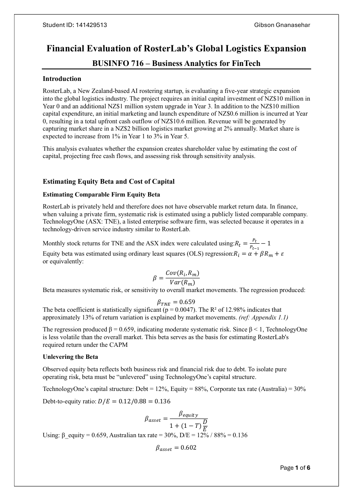

# FinTech Investment Appraisal — RosterLab

**Course:** BUSINFO 716 — Business Analytics for FinTech (individual)

### The problem
Should **RosterLab** (a NZ AI-rostering startup) commit **NZ$10M** to a five-year expansion into global logistics? Does it create shareholder value?

### What I did
- Estimated cost of capital via **CAPM**. As RosterLab is private, used a listed comparable (**TechnologyOne, ASX:TNE**) and ran an **OLS regression** of monthly returns to estimate equity beta (β = 0.659, p = 0.0047).
- **Unlevered and re-levered** beta to isolate operating risk.
- Projected five-year free cash flows and ran **sensitivity analysis** on the value drivers.

### Tools
Excel (modelling & sensitivity) · regression · CAPM/DCF.

### Files
`fintech_rosterlab_model.xlsx` (valuation model) · `report.pdf`
