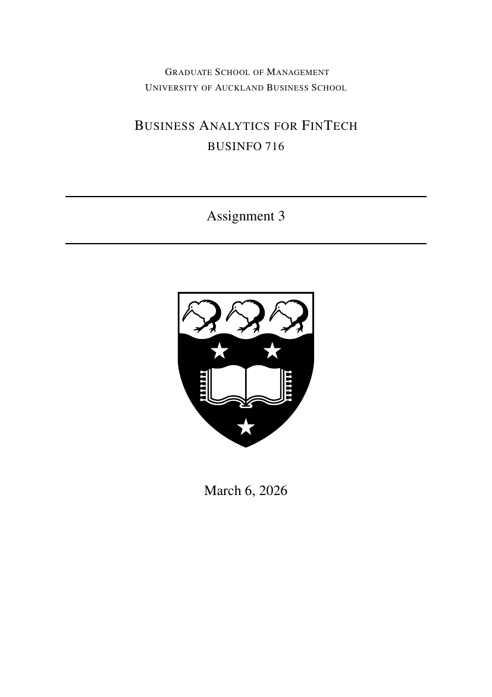

# Machine Learning Models (Python)

**Course:** BUSINFO 716 — Business Analytics for FinTech (individual)

A set of Python machine-learning and simulation tasks applied to financial datasets.

### What's here
- **`tree_regression_interest_rates.ipynb`** — tree-based regression modelling how borrower characteristics (credit grade, debt-to-income, etc.) drive loan interest rates, using LendingClub's open dataset. Includes EDA and model evaluation.
- **`decision_tree_house_prices.ipynb`** — decision-tree regression predicting house prices from property features.
- **`monte_carlo_simulation.ipynb`** — simulation-based estimation of a random process.
- **`report.pdf`** — written assignment report.

### Tools
Python · pandas · scikit-learn · matplotlib · Jupyter.

> The `.ipynb` notebooks render on GitHub with code, charts and notes visible.
