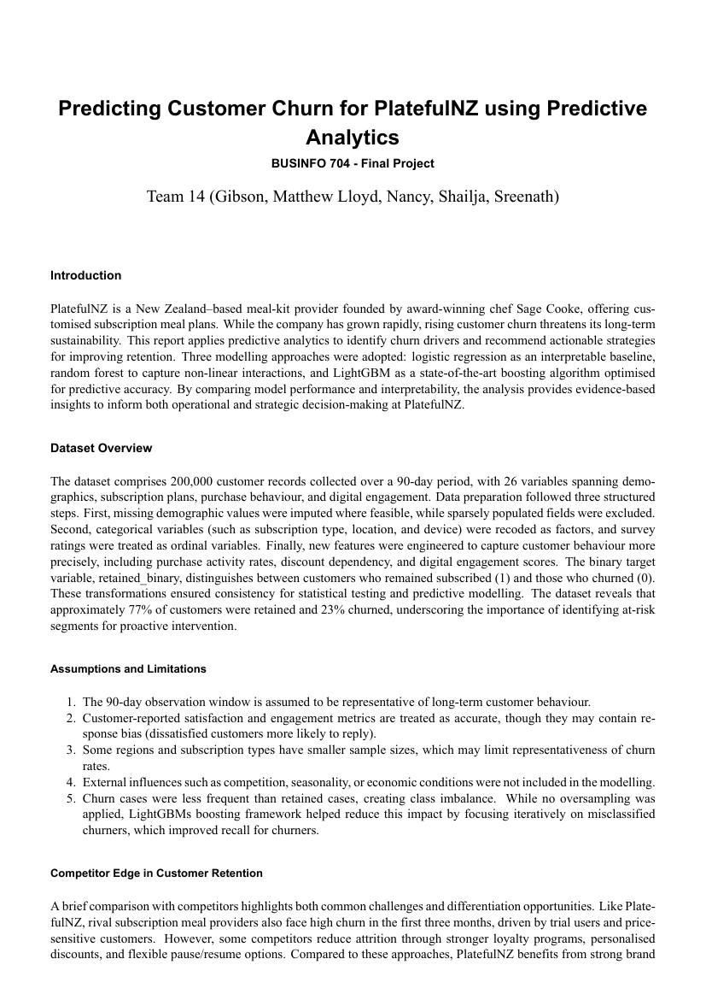

# PlatefulNZ — Data Analysis Poster & Report

**Course:** BUSINFO 704 — Statistics for Business (group; my focus: data analysis & visualisation)

### The problem
Analyse PlatefulNZ data to surface insights for a business audience, presented as an academic poster plus a supporting report.

### What I did
- Cleaned and analysed the dataset in **R / Quarto**, producing the statistical analysis behind the findings.
- Built visualisations and contributed to the narrative on the poster.

### Tools
R · tidyverse · Quarto · data visualisation.

### Files
`poster.pdf` (final research poster) · `report.pdf` · `analysis.qmd` (source)
