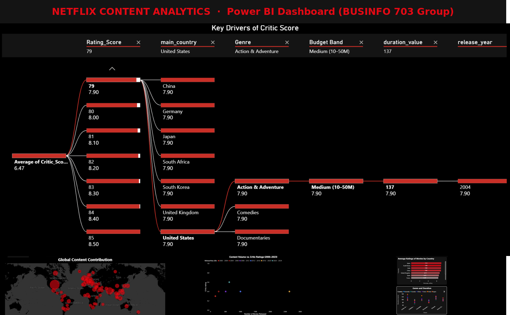

# Power BI Dashboards — Netflix Analytics & OECD Storytelling

**Course:** BUSINFO 703 — Data Visualisation for Business

Two Power BI projects: a **group Netflix content-analytics dashboard** (above) and an **individual OECD data-storytelling** piece.

---

## ⭐ Netflix Content Analytics Dashboard (group)
An interactive Power BI report exploring what drives Netflix content performance, combining the Netflix catalogue with IMDb ratings.

- **Key Drivers of Critic Score** — a decomposition-tree view breaking critic score down by rating, country, genre, budget band and duration.
- **Global Content Contribution** — world map of content volume by country.
- **Content Volume vs. Critic Ratings**, **Average Ratings by Country**, and **Genre & Duration** analyses.
- Applied **unsupervised machine learning (clustering) in R** to segment titles, surfaced through the dashboard.

**Files:** `netflix_dashboard.pbix` (open in Power BI Desktop) · `netflix_clustering.R` · `group_assignment_brief.pdf`

## OECD Data-Storytelling (individual)
Cleaned and modelled multi-country OECD data entirely in **Power Query + DAX**, built interactive visuals, and contrasted an **ethical visualisation against a misleading one** to demonstrate visualisation ethics.

**Files:** `powerbi_dashboard.pbix` · `reflection.pdf`

### Tools
Power BI · Power Query · DAX · R (clustering) · data storytelling.
